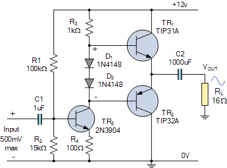
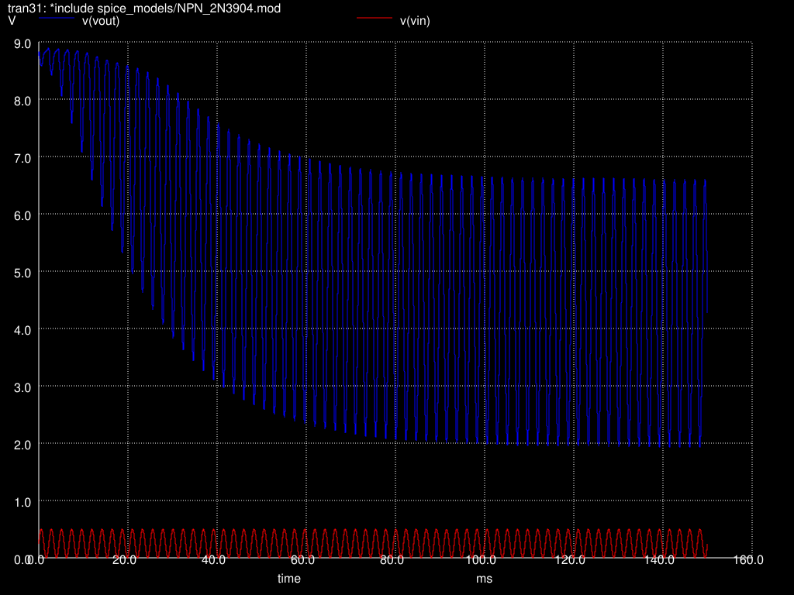

# A simple amplifier

Although simple IC's are available (like the LM386) I want to make it from scratch. 

The idea, again, is to work backards. Therefore, the start is made at the speakers or headphones. An input impedance of **16 ohm** is concidered.

The output capacitance of the class B amp is therefore: 

```
C = 1 / (2 pi R f) = 1 / (2 pi 16 20) = 0.0004976
C = 470 µF
```

A Class-A amplifier has a drawback of not being power efficient. A Class-B amplifier has distortion as drawback. Hence, an Class-AB amplifier is made.

This is very well explained at [this site](https://www.electronics-tutorials.ws/amplifier/class-ab-amplifier.html).

A NPN and PNP transistor are put in series. The NPN follows in the positive half of the period and the PNP in the negative (as with Class-B). Due to the 0.7V drop before turning on, the input signal is increased-and-decreased with 0.7V to compensate and prevent distortion.Putting **R3-D1-D2-R4** in front fixes the 0.7V offset.

When temperature increases this balance might break.




Rescaling this design to a 9V power supply gives this.


Biasing T1 at 1.6V
```
12V/115k = Vb/15k
Vb = 15/115*12V = 1.57V
9V/(220k+47k) = Vb/47k
Vb = 47/267*9V = 1.58V
```




## Requirement

* input signal is 0mV-500mV
* Rload = 16Ω

## BOM

| component | value |
|---|---|
|R1|220kΩ|
|R2|47kΩ|

|R3|47kΩ|
|R4|47kΩ|

|D1|1N4186|
|D2|1N4186|
|C1|1µF|
|C2|470µF|
|Q1|2N3904|
|Q2|2N3904|
|Q3|2N3906|
