# A simple amplifier

Although simple IC's are available (like the LM386) I want to make it from scratch. Through some help of Claude.ai, this is the outcome.

Here's what we'll build: a two-stage BJT audio amplifier. The **first stage** is a common-emitter voltage amplifier, the **second** is a complementary push-pull emitter follower to drive the low impedance of headphones (typically 32Ω).




> All caps should be electrolytic, rated at least 16V. Mind the polarity — positive side toward the higher voltage point.

Power it from a 9V battery to start — the 2N3904/2N3906 pair are cheap, widely available, and forgiving for beginners. You should hear clear audio through the headphones. Once this works, you'll wire the detector/demodulator stage in front of it to complete the receiver.


## Stage 1: Preamp

Stage 1 (Q1) is a classic common-emitter amplifier. The R1/R2 divider sets Q1's base at about 1.6V.

```
9V / (220k+47k) = V_b/(47k) 
==>  V_b = 47/(220+47) * 9V = 1.58V
```

This puts the collector sitting near 4–5V — right in the middle of your supply, giving it room to swing both ways. 

```
V<sub>e</sub> = 1.6-0.7 = 0.9 V
R_e = 1k => Ie = 0.9 mA
Beta is 100-300 => Ic~= 0.9mA
Ic flows through Rc => deltaV over RC = Ic + Rc
= .9mA * 4.7k = 4.23V
```

Therefor Vout of stage 1 is around 9V - 4.23V = 4.77V


RC is the collector load that converts current changes into a voltage signal. RE stabilizes the operating point against temperature drift, and CE shorts RE for AC signals so you get the full voltage gain (around 40–60×) without RE robbing it.

## Stage 2

Stage 2 (Q2/Q3) is a complementary emitter follower. Q2 handles the positive half of each audio wave, Q3 handles the negative half. Together they can source and sink enough current to drive your 32Ω headphones without distorting. R3/R4 bias the midpoint to half the supply voltage (~4.5V) so the output can swing equally up and down. R5/R6 limit crossover glitches and protect the transistors.

The three coupling caps (C1, C2, C3) block DC from the previous stage while passing audio frequencies. At 10–100 µF they present less than 10Ω of reactance at 300 Hz, which is well within CB voice frequencies.
